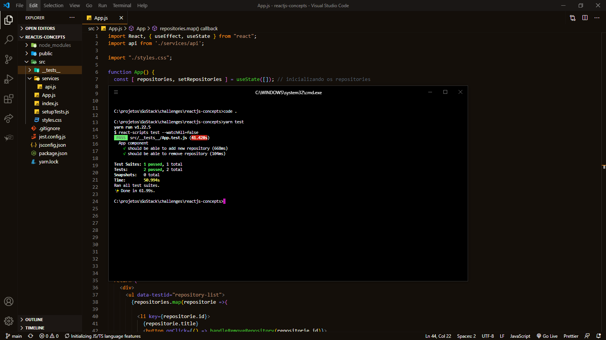

_English_

# React.JS Concepts

🚀 About the challenge

The objective of this challenge was to list, add and remove repositories for an API being able to create a list with the title field of all repositories that are registered in that API.

`Screenshot of tests`

---

_Português_

# Conceitos do React.JS

🚀 Sobre o desafio

O objetivo desse desafio foi listar, adicionar e remover os repositórios de uma API sendo capaz de criar uma lista com o campo title de todos os repositórios que estão cadastrados nessa API.

`Captura de tela dos testes`

